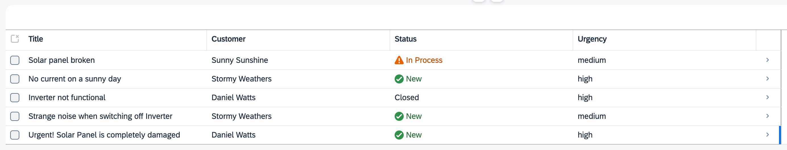

# Exercise 4 - Add Custom Logic

In this exercise, we will learn
- How to add custom code to your CAP service that changes the value of the **urgency** property and validates the incident **status**.
- How CAP automatically treats the JavaScript file that you add as a handler
- Debugging

## Add custom code

In this tutorial, you add some custom code to the CAP application. Depending on the contents of the **title** property, the custom code changes the value of the **urgency** property. Additionally, we will block a user from changing an already **closed** incident.

1. In SAP Business Application Studio, go to your **IncidentManagement** dev space.

    > Make sure the **IncidentManagement** dev space is in status **RUNNING**.

2. Create a new **processor-service.js** file in the **srv** folder of the **INCIDENT-MANAGEMENT-xxx** application.

3. Add the following code (the actual business logic) to the **processor-service.js** file:

    ```js
    const cds = require('@sap/cds')

    class ProcessorService extends cds.ApplicationService {
      /** Registering custom event handlers */
      init() {
        this.before("UPDATE", "Incidents", (req) => this.onUpdate(req));
        this.before("CREATE", "Incidents", (req) => this.changeUrgencyDueToSubject(req.data));

        return super.init();
      }

      changeUrgencyDueToSubject(data) {
        if (data) {
          const incidents = Array.isArray(data) ? data : [data];
          incidents.forEach((incident) => {
            if (incident.title?.toLowerCase().includes("urgent")) {
              console.log("Setting urgency to High");
              incident.urgency = { code: "H", descr: "High" };
            }
          });
        }
      }

      /** Custom Validation */
      async onUpdate (req) {
        const { status_code } = await SELECT.one(req.subject, i => i.status_code).where({ID: req.data.ID})
        if (status_code === 'C') {
          console.log("Block changing a closed incident");
          return req.reject(`Can't modify a closed incident`)
        }
      }
    }
    module.exports = ProcessorService
    ```

3. Make sure the SAP Fiori application is running. If you closed it, choose the **Preview Application** option in the **Application Info - incidentsxxx** tab and select the **watch-incidents** npm script.

    > To open the **Application Info - incidentsxxx** tab: 
    >
    >1. Invoke the Command Palette - **View** &rarr; **Command Palette** or <kbd>Command</kbd> + <kbd>Shift</kbd> + <kbd>P</kbd> for macOS / <kbd>Ctrl</kbd> + <kbd>Shift</kbd> + <kbd>P</kbd> for Windows. 
    >2. Choose **Fiori: Open Application Info**.

4. Create a new incident with the word **urgent** in its title and with the urgency set to **medium**. You'll see that the value in the **Urgency** field is automatically set to **high**.

    


## Understand the custom code

Because the custom code file is called **processor-service.js** and has the same name as your CAP service cds file **processor-service.cds**, CAP automatically treats it as a handler file for the CAP service. CAP exposes several [events](https://cap.cloud.sap/docs/node.js/events) and you can easily write handlers like the one mentioned above.

> CAP includes default handlers for all CRUD events on entities that are tables. All out-of-the-box!

In this case, an event handler is triggered **before** the default CAP handlers for a **CREATE** or **UPDATE** on the **Incidents** entity.

The **before** code will execute and immediately after, CAP's default handler will carry on.

For the **CREATE** handler you can see it passes the new Incident data to the `changeUrgencyDueToSubject()` method, where it decides whether or not to set the Urgency to High.

> You can run custom code **before** or **after** the default handlers and even completely replace the default with an **on** handler (and programmatically call the default logic with `next()` if need be).

## Debugging

Debugging your CAP custom code can be done with the built-in visual javascript debugger, like this:

1. Kill any running app preview or `cds watch`.

2. Hit the `F1` key (see other options below) to bring up the BAS/VSCode command palette and search on debug terminal, select __Javascript: Debug Terminal__.

    > To invoke the Command Palette, choose the burger menu and then choose **View** &rarr; **Command Palette**.

    > You can also invoke the Command Palette quickly using the following key combination:
    >
    > - For macOS: <kbd>Command</kbd> + <kbd>Shift</kbd> + <kbd>P</kbd>
    > - For Windows: <kbd>Ctrl</kbd> + <kbd>Shift</kbd> + <kbd>P</kbd>

3. In this terminal, start `cds watch` as usual (or `cds watch --profile hybrid`). The debugger starts and attaches to this process.

4. Set a break-point in the source and run your app - test as per usual!

> A run configuration in BAS (and/or vscode) can also be used to launch your app in debug mode. Note that you can debug against real BTP services (instead of mocks) as shown later with **hybrid** development. It is also possible to <a href="http://community.sap.com/t5/technology-blogs-by-sap/set-up-remote-debugging-to-diagnose-cap-applications-node-js-stack-at/ba-p/13515376" target="_blank">remotely debug applications</a> running on BTP Cloud Foundry.

## Summary

Continue to - [Exercise 5 - Use a Local Launch Page](../Use%20a%20Local%20Launch%20Page/README.md)
