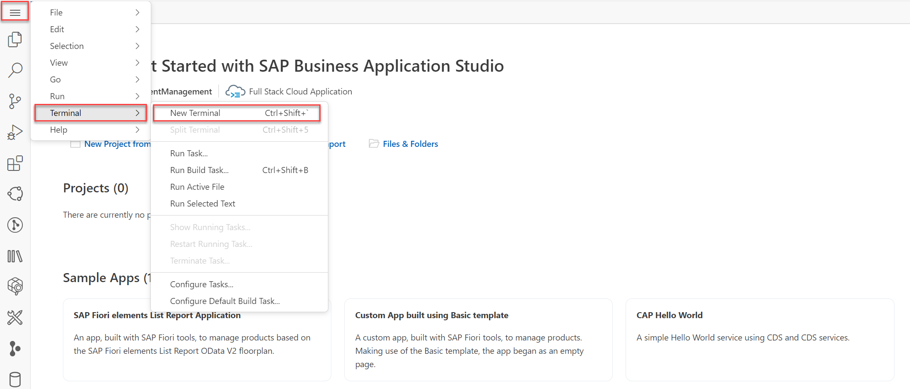
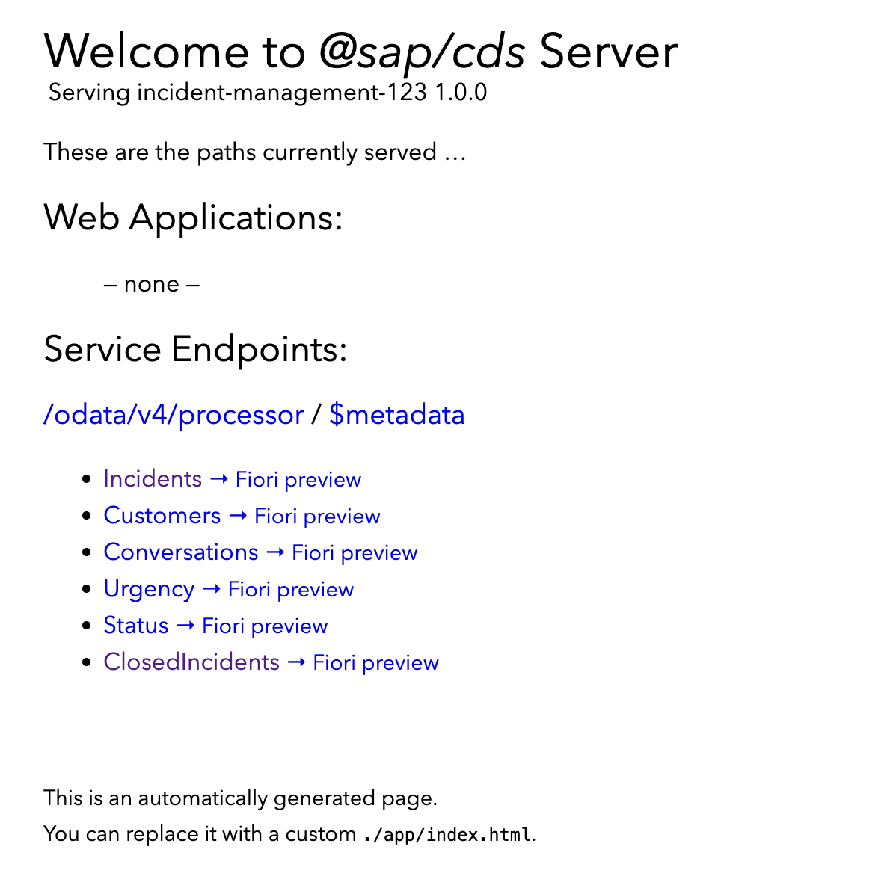
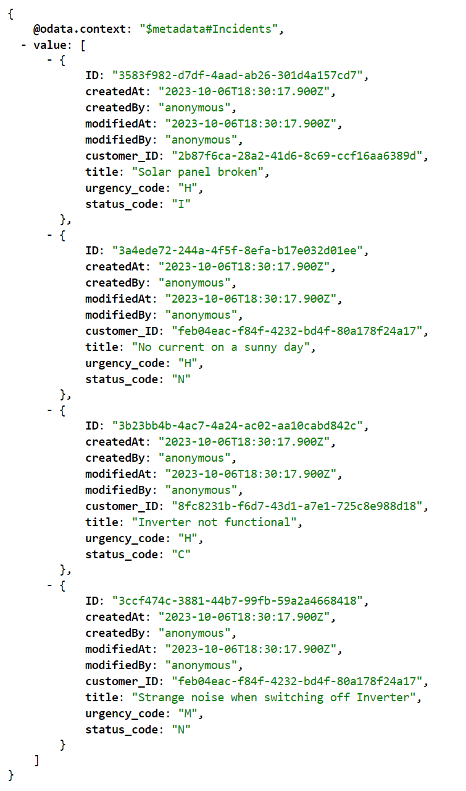
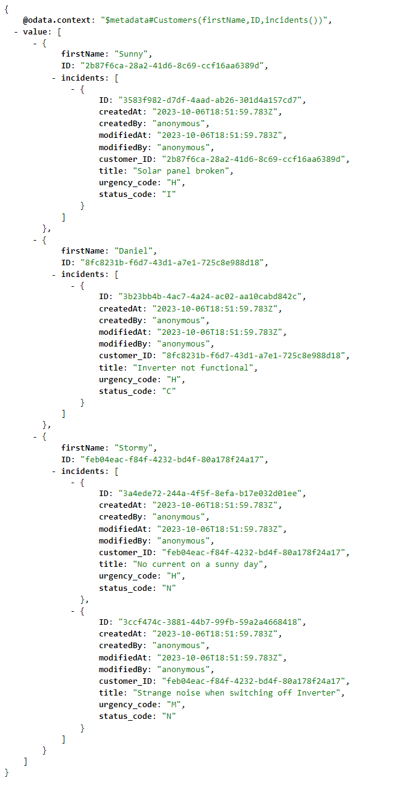
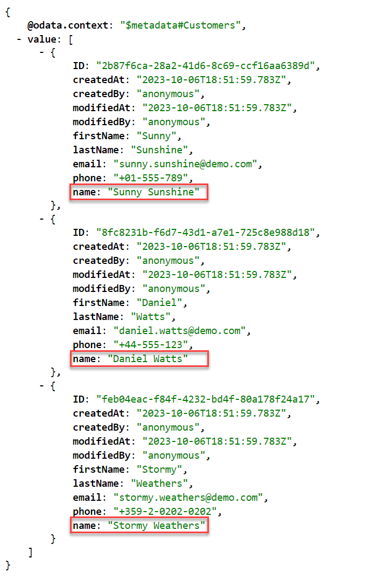
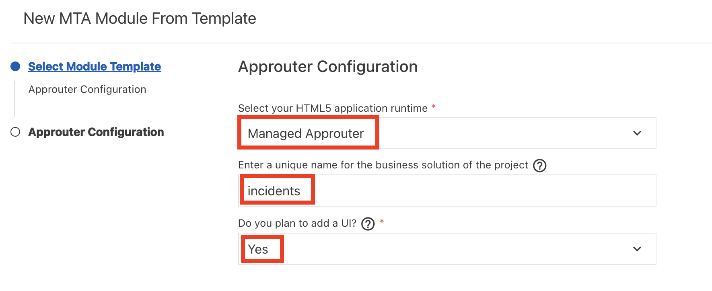

# Exercise 2 - Build a CAP application

In this exercise, we will learn
- How to create a CAP project
- How to add a domain model
- How to create services
- How to add test/configuration data to your database
- How to add calculated elements
- Add CAP config for later deployment to BTP Cloud Foundry
- Add Approuter

## Create a CAP project

1. In SAP Business Application Studio, go to your **business application** dev space.

    > Make sure the dev space is in status **RUNNING**.
    > If you don't yet have a dev space you will be prompted to create one - use the dev space type: "Full-Stack Cloud Application"

2. Choose the burger menu and choose **Terminal** &rarr; **New Terminal**.

    

3. Navigate to the **projects** folder from the root directory.

    ```bash
    cd projects
    ```

    > Your main interaction will be through the `cds` command. It is used to build, run, and debug your CAP application. Besides that, you can also use `cds` to enrich your application with additional capabilities such as messaging, multitenancy, or cloud integration. You can learn more about the tool's capabilities in [Command Line Interface (CLI)](https://cap.cloud.sap/docs/tools/#command-line-interface-cli).

4. Create a new project using [`cds init`](https://cap.cloud.sap/docs/tools/#cds-init-add).
   Use your allocated BTP user number for `xxx`.
   Eg., If your BTP user name is p123456, use 123456 as the `xxx`.

    ```bash
    cds init incident-management-<xxx>
    ```

    > This command creates a folder `incident-management-<xxx>` with your newly created CAP project.
    ```bash
    cd incident-management-<xxx>
    ```

5. Choose the **Explorer** icon and then choose **Open Folder**. Type `/home/user/projects/` in the field and select `incident-management-xxx`. Choose **OK** to open the project in SAP Business Application Studio.

    

    > You can also use the **Ctrl+Shift+E** key combination to quickly navigate to the **Explorer**.
    > You new project should also appear on the Getting Started page.

    > When the project re-opens you may need to re-open the terminal as well.

6. Inspect the generated project.
    > `cds init` will create a best practice directory project structure similar to this:
    ```bash
    my-cap-server/
    ├── app/
    │   ├── ui5-app/
    │   │   ├── webapp/
    │   │   ├── package.json
    │   │   └── ui5.yaml
    │   ├── fe-app/
    │   │   ├── webapp/
    │   │   ├── package.json
    │   │   └── ui5.yaml
    │   └── other-app/
    │       ├── webapp/
    │       ├── package.json
    │       └── ui5.yaml
    ├── db/
    │   ├── data/
    │   └── schema.cds
    ├── srv/
    │   └── service.cds
    └── package.json
    ```

7. Use git to manage the project

    `git` is the most widely used software management and versioning tool. Let's add git to our project (**optional**).

    In the terminal:
    ```bash
    git init
    ```

    This creates a local git repository for your project.

    > It might be handy to commit your changes to git after each exercise is completed so that you have a point to revert back to in case of a mistake. To commit your changes at any time:

    ```bash
    git add -A
    git commit -m "<a commit message>"
    ```

    In a real-world scenario you would setup a `remote` to [GitHub.com](https://github.com) or some other git server and routinely push your changes to it.

8. While you are in the `<incident-management-xxx>` folder, choose the burger menu and then choose **Terminal** &rarr; **New Terminal**.

    Now you can use the terminal to start a CAP server.

    ```bash
    cds watch
    ```

    The CAP server serves all the CAP sources from your project. It also "watches" all the files in your projects and conveniently restarts whenever you save a file. Changes you've made are immediately served without you having to run the command again. In this newly created project the CAP server tells you that there are no models or service definitions yet that it can serve.

    This is the output you should get:

    ```
    cds serve all --with-mocks --in-memory?
    live reload enabled for browsers

    ___________________________

    No models found in db/,srv/,app/,schema,services.
    Waiting for some to arrive...
    ```

## Add a domain model

1. In the **db** folder, create a new **schema.cds** file.

2. Paste the following code snippet in the **schema.cds** file.

    ```js
    using { cuid, managed, sap.common.CodeList } from '@sap/cds/common';
    namespace sap.capire.incidents;

    /**
     * Incidents created by Customers.
     */
    entity Incidents : cuid, managed {
      customer     : Association to Customers;
      title        : String  @title : 'Title';
      urgency      : Association to Urgency;
      status       : Association to Status; 
      conversations: Composition of many Conversations on conversations.incidents = $self;
    }

    /**
     * Customers entitled to create support Incidents.
     */
    entity Customers : cuid, managed {
      firstName     : String;
      lastName      : String;
      email         : EMailAddress;
      phone         : PhoneNumber;
      incidents     : Association to many Incidents on incidents.customer = $self;
    }

    entity Conversations : cuid, managed {
      incidents : Association to Incidents;
      timestamp : DateTime;
      author    : String @cds.on.insert: $user;
      message   : String;
    }

    entity Status : CodeList {
      key code: String enum {
          new = 'N';
          assigned = 'A'; 
          in_process = 'I'; 
          on_hold = 'H'; 
          resolved = 'R'; 
          closed = 'C'; 
      };
      criticality : Integer;
    }

    entity Urgency : CodeList {
      key code: String enum {
          high = 'H';
          medium = 'M'; 
          low = 'L'; 
      };
    }

    type EMailAddress : String;
    type PhoneNumber : String;
    type City : String;
    ```

As soon as you save your file, the CAP server that is still running reacts immediately with a new output:

```bash
[cds] - loaded model from 2 file(s):

  db/schema.cds
  ../../../../managed-content/globals/pnpm/5/.pnpm/@sap+cds@7.5.2_express@4.18.2/node_modules/@sap/cds/common.cds

[cds] - connect using bindings from: { registry: '~/.cds-services.json' }
[cds] - connect to db > sqlite { database: ':memory:' }
/> successfully deployed to in-memory database. 


[cds] - server listening on { url: 'http://localhost:4004' }
[cds] - launched at 1/17/2024, 1:57:33 AM, version: 7.5.2, in: 492.344ms
[cds] - [ terminate with ^C ]


    No service definitions found in loaded models.
    Waiting for some to arrive...
```

This means that the CAP server detected the changes in **schema.cds** and automatically created an in-memory SQLite database when restarting the server process. However, the CAP server also prints this message:

```bash
No service definitions found in loaded models.
Waiting for some to arrive...
```

> Note: When running in the Business Application Studio, `localhost` is not the _localhost_ on your pc. Navigating your browser to `localhost` won't work. You need to click the localhost link in BAS to open the correct cloud url.
    However, if you are truly working locally on your pc with VSCode then the `locahost` url will work fine.

3. Optional. Inspect the database.

    We can quickly inspect the data - or more to the point: what will be created in the database via:

    ```bash
    cds compile db --to sql
    ```

    > In BAS you can also right-click on the data model file and choose to display this with `CDS Preview As...`.

## Create services

It's a good practice in CAP to create single-purpose services. Hence, let's define a `ProcessorService` for support engineers to process incidents created by customers.

To create the service definitions:

1. In the **srv** folder, create a new **processor-service.cds** file.

2. Paste the following code snippet in the **processor-service.cds** file:

    ```js
    using { sap.capire.incidents as my } from '../db/schema';

    service ProcessorService { 
      @cds.redirection.target
      entity Incidents as projection on my.Incidents;
      entity Customers as projection on my.Customers;
      entity Conversations as projection on my.Conversations;
      entity Urgency as projection on my.Urgency;
      entity Status as projection on my.Status;

      /* Example of a restricted projection */
      entity ClosedIncidents as projection on my.Incidents {
        ID,
        title,
        modifiedBy,
        modifiedAt
      } where status.code = 'C'
    }
    ```
  
    This time, the CAP server reacted with additional output:

    ```bash
    [cds] - serving ProcessorService { path: '/odata/v4/processor' }

    [cds] - server listening on { url: 'http://localhost:4004' }
    [cds] - [ terminate with ^C ]
    ```

    As you can see in the log output, the new file created a generic service provider `ProcessorService` that serves requests on the `/odata/v4/processor` endpoint. If you open the link `http://localhost:4004` from SAP Business Application Studio in your browser, you'll see the generic `index.html` page:

    

    You may have to stop the CAP server with <kbd>Ctrl</kbd> + <kbd>C</kbd> and start it again with the `cds watch` command.

    > Note: you can change the path for the OData service with the annotation: `service ProcessorService @( path: '/cust' ) { ...`.

## Generate test data

Since we already have an SQLite in-memory database that was automatically created in the previous step, let's now fill it with some test data.

1. Run the following command in the terminal (inside the **incident-management** root folder of your project):

    ```bash
    cds add data
    ```

2. Check the output.

    ```bash
    Adding feature 'data'...
    Creating db/data/sap.capire.incidents-Incidents.csv
    Creating db/data/sap.capire.incidents-Customers.csv
    Creating db/data/sap.capire.incidents-Conversations.csv
    Creating db/data/sap.capire.incidents-Status.csv
    Creating db/data/sap.capire.incidents-Urgency.csv
    Creating db/data/sap.capire.incidents-Status.texts.csv
    Creating db/data/sap.capire.incidents-Urgency.texts.csv

    Successfully added features to your project.
    ```

### Fill in the test data

Replace the respective generated CSV templates with the following content:

- `db/data/sap.capire.incidents-Customers.csv`:

    ```csv
    ID,firstName,lastName,email,phone
    8fc8231b-f6d7-43d1-a7e1-725c8e988d18,Daniel,Watts,daniel.watts@demo.com,+44-555-123
    feb04eac-f84f-4232-bd4f-80a178f24a17,Stormy,Weathers,stormy.weathers@demo.com,+359-2-0202-0202
    2b87f6ca-28a2-41d6-8c69-ccf16aa6389d,Sunny,Sunshine,sunny.sunshine@demo.com,+01-555-789
    ```

- `db/data/sap.capire.incidents-Incidents.csv`:

    ```csv
    ID,customer_ID,title,urgency_code,status_code
    3b23bb4b-4ac7-4a24-ac02-aa10cabd842c,8fc8231b-f6d7-43d1-a7e1-725c8e988d18,Inverter not functional,H,C
    3a4ede72-244a-4f5f-8efa-b17e032d01ee,feb04eac-f84f-4232-bd4f-80a178f24a17,No current on a sunny day,H,N
    3ccf474c-3881-44b7-99fb-59a2a4668418,feb04eac-f84f-4232-bd4f-80a178f24a17,Strange noise when switching off Inverter,M,N
    3583f982-d7df-4aad-ab26-301d4a157cd7,2b87f6ca-28a2-41d6-8c69-ccf16aa6389d,Solar panel broken,H,I
    ```

- `db/data/sap.capire.incidents-Conversations.csv`:

    ```csv
    ID,incidents_ID,timestamp,author,message
    2b23bb4b-4ac7-4a24-ac02-aa10cabd842c,3b23bb4b-4ac7-4a24-ac02-aa10cabd842c,1995-12-17T03:24:00Z,Harry John,Can you please check if battery connections are fine?
    2b23bb4b-4ac7-4a24-ac02-aa10cabd843c,3a4ede72-244a-4f5f-8efa-b17e032d01ee,1995-12-18T04:24:00Z,Emily Elizabeth,Can you please check if there are any loose connections?
    9583f982-d7df-4aad-ab26-301d4a157cd7,3583f982-d7df-4aad-ab26-301d4a157cd7,2022-09-04T12:00:00Z,Sunny Sunshine,Please check why the solar panel is broken.
    9583f982-d7df-4aad-ab26-301d4a158cd7,3ccf474c-3881-44b7-99fb-59a2a4668418,2022-09-04T13:00:00Z,Bradley Flowers,What exactly is wrong?
    ```

- `db/data/sap.capire.incidents-Status.csv`:

    ```csv
    code;descr;criticality
    N;New;3
    A;Assigned;2
    I;In Process;2
    H;On Hold;3
    R;Resolved;2
    C;Closed;4
    ```

- `db/data/sap.capire.incidents-Urgency.csv`:

    ```csv
    code;descr
    H;High
    M;Medium
    L;Low
    ```

    > Notice that `cds add data` created seven files, while we're adding data to just five of them. We're leaving the files `sap.capire.incidents-Status.texts.csv` and `sap.capire.incidents-Urgency.texts.csv` empty because they hold translated text that will be filled once the application is localized and translations are created.

Upon detecting these new files, the CAP server prints a message stating that the content of the files has been filled into the database automatically:

```bash
[cds] - connect to db > sqlite { database: ':memory:' }
  > init from db\data\sap.capire.incidents-Conversations.csv 
  > init from db\data\sap.capire.incidents-Customers.csv 
  > init from db\data\sap.capire.incidents-Incidents.csv 
  > init from db\data\sap.capire.incidents-Status.csv 
  > init from db\data\sap.capire.incidents-Status.texts.csv 
  > init from db\data\sap.capire.incidents-Urgency.csv 
  > init from db\data\sap.capire.incidents-Urgency.texts.csv 
/> successfully deployed to in-memory database.
```
> Make sure your CAP server is still running. You can start it with `cds watch`.

Now that the database is filled with some initial data, you can send complex OData queries served by the built-in generic service providers. With the generic `index.html` page opened in your browser, paste the following queries at the end of the current URL and check the result:

- `/odata/v4/processor/Incidents`

    

- `/odata/v4/processor/Customers?$select=firstName&$expand=incidents`

    

> When you revisit the **Incidents** or the **Customers** endpoint, you might see something like this instead of the nicely formatted output from above.
>
> 
>
> However, this doesn't mean you've made a mistake in the tutorial. Rather, this is the correct output without any formatting. If you'd like to see a formatted output in your browser, you can add an extension to your browser. Here are a few exemplary JSON formatters for different browsers:
>
> - [Chrome](https://chrome.google.com/webstore/detail/jsonvue/chklaanhfefbnpoihckbnefhakgolnmc)
> - [Microsoft Edge](https://microsoftedge.microsoft.com/addons/detail/jsonview/kmpfgkgaimakokfhgdahhiaaiidiphco)
> - [Safari](https://apps.apple.com/us/app/json-peep-for-safari/id1458969831?mt=12)

> __WARNING!__
    Be careful adding test data files to the `db/data` (can also use `db/csv`). When deploying to production these will be imported into the HANA database and will therefore overwrite any existing data that you may have.
    To avoid this - only use csv files in `db/data` for configuration type data. For transactional type data (like _incidents_) you can place the csv files inside the `test/data` folder instead as these will be ignore by CAP on deployment!

## Add calculated elements

Elements can be specified with a calculation expression, in which you can refer to other elements of the same entity. These calculated elements are used for convenience. For more information, see [Calculated Elements](https://cap.cloud.sap/docs/cds/cdl#calculated-elements).

1. Navigate to the `srv` folder.

2. Open the `processor-service.cds` file and add the following lines to it:

    ```js[4-6]
    service ProcessorService {
      ...
    }
    extend projection ProcessorService.Customers with {
      firstName || ' ' || lastName as name: String
    }
    ```

3. Click the `Customers` endpoint from the `index.html` page and you'll see the new field `name` for each entry. The value for this field for each of the entries is calculated by taking into account the values of the fields `firstName` and `lastName`.

    

> You now have a compliant OData V4 service with full CRUD capabilities!


## Add deployment configuration - PART 1 - HANA/MTA

Here we perform some configuration steps to setup for deployment to SAP BTP Cloud Foundry.

1. Set config to use SAP HANA Cloud in production.

    Run the following command in the terminal (within the **incident-management** root folder of your project):

    ```bash
    cds add hana --for production
    ```

    Note the `--for production` which is important as we only want CAP to use hana when running in production.

    > Assumes you have the pre-requisite HANA Cloud instance available to your BTP Cloud Foundry org & space.
    > To create a [HANA Cloud instance check this tutorial](https://developers.sap.com/tutorials/btp-app-hana-cloud-setup.html).

2. Add a Multi-Target Archive (MTA) config file to the project.

    Run the following command in the terminal (in the project root folder as usual) to create an mta.yaml file to describe the deployment process to SAP BTP Cloud Foundry.

    ```bash
    cds add mta
    ```

## Add deployment configuration - PART 2 - Approuter

The [application router](https://help.sap.com/docs/btp/sap-business-technology-platform/application-router) is used to serve static content, authenticate users, rewrite URLs, and forward or proxy requests to other micro services while propagating user information. This tutorial uses SAP Managed Application Router, which requires a subscription to SAP Build Work Zone service.

> _An application router is necessary for CAP projects if you want to add UI apps. It performs the function of a reverse-proxy in-front of your application components (microservices)._


1. Right-click on the `mta.yaml` file that was created in the previous step. Select "Create MTA Module from Template".

2. A new template page opens, select the module template "Approuter Configuration" and click Start.

3. Keep "Managed Approuter" (important) and provide a name for the Approuter (no hyphens and all lowercase) like `incidents<xxx>`. Select "Yes", you plan to add a Fiori UI.

    

4. Click next, this will generate the approuter configuration in mta.yaml and you will get a xs-security.json file.

> If the application router is added to your project afterwards, then ensure to choose the option *do not overwrite* when finishing. See here for details: https://developers.sap.com/tutorials/deploy-to-cf.html

## Add deployment configuration - PART 3 - XSUAA

1. Add xsuaa dependencies and configuration to the project.
    > `xsuaa` is the technical name for the [SAP BTP Authorization & Trust Management Service](https://help.sap.com/docs/authorization-and-trust-management-service/authorization-and-trust-management/sap-authorization-and-trust-management-service-in-cloud-foundry-environment).

    Performing this step after the approuter will mean no manual config changes are required in the mta.yaml.

    ```bash
    cds add xsuaa --for production
    ```

    ```
    npm i
    ````

    > Along with settings in the `cds.requires` section of the `package.json` file this step adds a new file to the project: `xs-security.json`. This is where we desribe the authorisation scopes, roles and role collections to be generated in BTP upon deployment.

    > `npm i` is a shortcut for `npm install`. This is to ensure any new dependencies we have added are installed locally (in BAS).

## Summary

You've now completed a basic incident managment app with CAP and have it ready for production deployment to SAP BTP Cloud foundry.

Continue to - [Exercise 3 - Add SAP Fiori Elements UIs](../Add%20Fiori%20Elements%20UIs/README.md)
