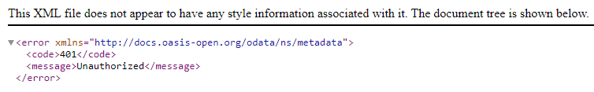

# Exercise 8 - Deploy in SAP BTP, Cloud Foundry Runtime

In this exercise we will learn
- How to deploy your CAP application as multi-target application (MTA)
- Create/Assign Role Collections to Users

## Introduction

The SAP BTP, Cloud Foundry environment allows you to create polyglot cloud applications in Cloud Foundry. It contains the SAP BTP, Cloud Foundry runtime, which is based on the open-source application platform managed by the Cloud Foundry Foundation.

The SAP BTP, Cloud Foundry environment enables you to develop new business applications and business services, supporting multiple runtimes, programming languages, libraries, and services.

For more information about the Cloud Foundry environment, see [Cloud Foundry Environment](https://help.sap.com/docs/btp/sap-business-technology-platform/cloud-foundry-environment).

## Assemble with the Cloud MTA Build Tool

Run the following command to assemble everything into a single `archive.mtar` archive:

```bash
npm run build
```

Once build is successfull a mtar will be created inside folder mta_archives.

See [Multitarget Applications in the Cloud Foundry Environment](https://help.sap.com/products/BTP/65de2977205c403bbc107264b8eccf4b/d04fc0e2ad894545aebfd7126384307c.html?locale=en-US) to learn more about MTA-based deployment.

## Deploy in the SAP BTP, Cloud Foundry runtime

1. From the root of the **INCIDENT-MANAGEMENT** project, choose the burger menu, and then choose **Terminal** &rarr; **New Terminal** (if not already open).

2. Log in to your subaccount in SAP BTP:

    ```bash
    cf api <API-ENDPOINT>
    ```

    > You can find the `<API-ENDPOINT>` in the **Overview** section of your subaccount in the SAP BTP cockpit.

3. Run command to login into cf:

    Login with password:
    ```bash
    cf login
    ```

    Or login with SSO:
    ```bash
    cf login --sso
    ```

    you can see **Temporary Authentication Code** URL on the terminal. Copy URL and open it in new tab.

    

4. You will see login page. Enter origin key of your identity provider key as **tdct3ched1-platform** and click on **Sign in    with alternate identity provider**.

    

5. Temporary Authentication code will be generated.

    

6. Copy temporary Authentication Code and paste into cf login terminal. You will see success message.

    

7. Now run the following command to deploy the generated archive to the SAP BTP, Cloud Foundry runtime:

    ```bash
    npm run deploy 
    ```

    > The deployment process can take a few minutes. Each BTP service instance must be created; the fiori app uploaded to the html5-repo service; database artefacts deployed and bindings between the CAP app and the relevant services created.
    It is possible with subsequent builds to only deploy a single module and it is also possible to perform parallel builds to increase performance.

    > In general, a developer will work locally (`cds watch`) for most of the time for rapid turnaround and feedback on code changes. Then make use of hybrid scenarios (which we will look at during a later exercise) where you can execute your service locally but have the BTP backing services like HANA Cloud connected. Then finally, you would deploy and test like in BTP.

8. Check if all services have been created:

    ```bash 
    cf services
    ```

    You should see the following services in your space:

    

9. Check if the apps are running:

    ```bash
    cf apps
    ```

    

10. Enter the route displayed for **incident-management-<xxx>-srv** in your browser.

    

    You see the CAP start page:

    

11. When you choose the **Incidents** service entity, you will see an error message. 

    

The service expects a so called JWT (JSON Web Token) in the HTTP Authorization header that contains the required authentication and authorization information to access the service. In the next tutorial, you will access your UIs from SAP Build Work Zone, standard edition. The SAP Build Work Zone, standard edition will trigger the authentication flow to provide the required token to access the service.

## Create a BTP Role Collection

To access the CAP app we need to be authorized with the `support` role. Here we will create a Role Collection containing the `support` role and assign it to our user.

1. Open the SAP BTP cockpit and navigate to your subaccount.

2. Choose **Security** &rarr; **Role Collections**, and then choose the icon to create a new role collection.

      

3. In the **Create Role Collection** dialog, enter **Incident Management Support-xxx** in the **Name** field and choose **Create**.
      >Use your teched user number for `xxx`. Eg., If your teched user name is XP260-001, use 001 as the `xxx`.

      

4. Choose the role collection **Incident Management Support-xxx** from the list of role collections and choose **Edit** on the right.

5. Open the value help in the **Role Name** field.

6. Search for the role **support**, select it, and choose **Add**.

7. Choose **Save**.

    > You can identify your role using `Application Identifier` as shown below. 
      
    

    > Role Collections can also be configured in the `xs-security.json` file.

### Assign a role collection to a user

1. Choose **Security** &rarr; **Users**, and then choose a user from the list.

2. Under **Role Collections** on the right, choose **Assign Role Collection**.

      

3. In the **Assign Role Collection** dialog, select the **Incident Management Support-xxx** role collection and choose **Assign Role Collection**.

      

## Summary

We have now successfully deployed the parts of our application to SAP BTP. Next we will add a Tile for our app to SAP Build Work Zone and test it.

Continue to - [Exercise 9 - Integrate your Application with SAP Build Work Zone, Standard Edition](../Integrate%20Your%20Application%20with%20SAP%20Build%20Work%20Zone,%20Standard%20Edition/README.md)

