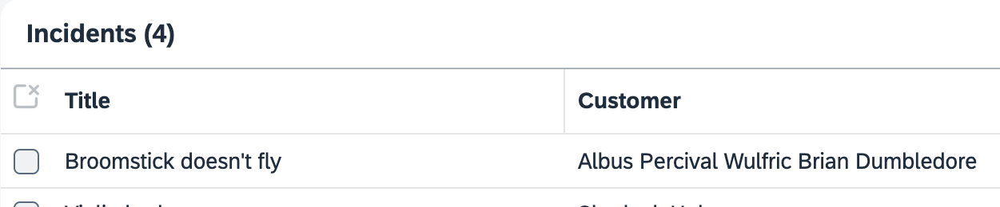

# Exercise 12 - OPTIONAL - Enable Replication for the Remote Entity

In this exercise you will learn
- How to replicate (or cache) data from our remote service
- Use CAP's event handling mechanism

In the incidents list, the application shall display (remote) business partner data together with (application-local) incident data. This raises a performance issue: when showing potentially hundreds of incidents, shall the app reach out to the remote system at all? Or just for single records, for all records at once, or for a chunk of records?

We use a different approach by replicating remote data on demand.

The scenario will look like this:

- The user enters a new incident and selects the customer through a value help. This value help shows only remote customer data.
- As soon as the incident record is created, the customer data is written to a local replica table.
- Further requests for the incident's customer are served from this replica table.
- Replicated records will be updated if a remote customer changes.

## Add persistent replica table

Start by adding a persistent table for the replicas. This can be done with just one line in `srv/mashup.cds`:

```js
annotate s4.simple.BusinessPartner with @cds.persistence: { table,skip:false };
```

The annotation `@cds.persistence: {table,skip:false}` turns the view above into a table with the same signature (ID and name columns). See the [documentation](https://cap.cloud.sap/docs/cds/annotations#persistence) for more on annotations that influence persistence.

## Replicate Data On Demand

1. Now there is code needed to replicate the customer record whenever an incident is created or updated. Update the file `srv/processor-service.js` with the following event handler inside the `init()` method:

    ```js
    this.after (['CREATE','UPDATE'], 'Incidents', async (data) => this.replicateBusinessPartner(data));
    ```

    Add the following `replicateBusinessPartner()` method to the object, immediately after `readBusinessPartner()`:

    ```js
      async replicateBusinessPartner(data) {
        const db = await cds.connect.to('db');
        const { BusinessPartner }  = db.entities('s4.simple');
        const { businessPartner_ID: ID } = data;

        if (ID) {
          let replicated = await db.exists (BusinessPartner, ID)
          if (!replicated) {
            console.log ('>> Updating business partner', ID);
            let businessPartner = await this.S4bupa.read (BusinessPartner,ID);
            await INSERT(businessPartner) .into (BusinessPartner);
          }
        }
      }
    ```

2. Remember previously we had to perform some special handling on expands for the remote entity....

    > Now that we are caching (or replicating) the data in the database, this is no longer necessary as CAP's default handlers take care of expands on _tables_.

    Remove the manual expand handling from _Incidents > BusinessPartner_. Delete the following event handler and its associated method in `srv/processor-service.js`:

    ```js
    this.on("READ", 'Incidents', async (req, next) => this.readIncidents(req, next));
    ```

3. Now create an incident in the UI. Don't forget to select a business partner through the value help.

    In the log, you can see the `>> Updating business partner` line, confirming that replication happens.

> Note: when you first run the app (with `cds watch`) the replica table for business partners will be empty. You will see that when you look at the app only the ID is shown and not the business partner name.
    This is just an artefact of using the in-memory SQLite db.
    We can switch to a persistent SQLite db to keep the replicated business partner data. It also won't be an issue in production with a real HANA Cloud db.
    See the [CAP documentation on how to use a persistent SQLite db](https://cap.cloud.sap/docs/guides/databases-sqlite#persistent-databases).

## Test without UI

With the [REST client for VS Code](https://marketplace.visualstudio.com/items?itemName=humao.rest-client) (this is pre-installed in BAS), you can conveniently test the same flow without the UI.

Create a file `tests.http` and this content:

```
###
# @name IncidentsCreate

POST http://localhost:4004/odata/v4/processor/Incidents
Authorization: Basic bob:
Content-Type: application/json

{
  "title": "New incident",
  "customer_ID": "feb04eac-f84f-4232-bd4f-80a178f24a17",
  "businessPartner_ID": "Z100001"
}

###
@id = {{IncidentsCreate.response.body.$.ID}}

POST http://localhost:4004/odata/v4/processor/Incidents(ID={{id}},IsActiveEntity=false)/draftActivate
Authorization: Basic bob:
Content-Type: application/json
```

- Click `Send Request` above the `POST .../Incidents` line. This will create the record in a draft tate.

- Click `Send Request` above the `POST .../draftActivate` line. This corresponds to the Save action in the UI.

    > This second request is needed for all changes to entities managed by SAP Fiori's draft mechanism.

You should see the same `>> Updating customer` server log.

## Event-based Replication

We haven't discussed yet how to update the cache table holding the BusinessPartner data. We'll use events to inform our application whenever the remote BusinessPartner has changed. Let's see what you need to do.

## Add Events to Imported APIs

First, as synchronous and asynchronous APIs from SAP S/4HANA sources are not comprised in the imported API definition (the edmx file), we have to add event defintitions manually. For the business partner model, the event information can be found at [https://api.sap.com/event/CE_BUSINESSPARTNEREVENTS/resource](https://api.sap.com/event/CE_BUSINESSPARTNEREVENTS/resource).

In file `srv/external/index.cds`, add this:

```js
// event definitions
extend service S4 {
  event BusinessPartner.Changed @(topic: 'sap.s4.beh.businesspartner.v1.BusinessPartner.Changed.v1') {
    BusinessPartner: S4.A_BusinessPartner:BusinessPartner;
  }
}
```

This allows [CAP's support for events and messaging](https://cap.cloud.sap/docs/guides/messaging) to kick in, which automatically subscribes to message brokers and emits events behind the scenes.

Also, the event name `BusinessPartner.Changed` is semantically closer to the domain and easier to read than the underlying technical event `sap.s4.beh.businesspartner.v1.BusinessPartner.Changed.v1`.

## React to Events

So, the piece to close the loop is code to consume events in the application.

In `srv/processor-service.js`, add this event handler (into the body of `init()` function):

```js
// update cache if BusinessPartner has changed
this.S4bupa.on('BusinessPartner.Changed', async ({ event, data }) => this.handleBusinessPartnerChange(event, data));
```

And now implement the handleBusinessPartnerChange method:

```js
async handleBusinessPartnerChange(event, data) {
    console.log('<< received', event, data);

    const db = await cds.connect.to('db');
    const { BusinessPartner }  = db.entities('s4.simple');
    const { BusinessPartner: ID } = data;

    const businessPartner = await this.S4bupa.read (BusinessPartner, ID);
    let exists = await db.exists (BusinessPartner,ID);
    if (exists) {
      await UPDATE (BusinessPartner, ID) .with (businessPartner);
    }
    else {
      await INSERT.into (BusinessPartner) .entries (businessPartner);
    }
}
```

## Emitting Events from Mocked Services

But who is the event emitter? Usually it's the remote data source, i.e. the SAP S4/HANA system. For local runs, it would be great if something could emit events when testing. Luckily, you can add a simple event emitter in a new file `srv/external/BusinessPartnerA2X.js`:

```js
module.exports = function () {
  const { A_BusinessPartner } = this.entities;
  
  this.after('UPDATE', A_BusinessPartner, async data => {
    const event = { BusinessPartner: data.BusinessPartner }
    console.log('>> BusinessPartner.Changed', event)
    await this.emit('BusinessPartner.Changed', event);
  })
}
```

This means whenever you change data through the BusinessPartnerA2X mock service, a local event is emitted. Also note how the event name `BusinessPartner.Changed` matches to the event definition from the CDS code above.

## Test caching a business partner as well as the update (via event) to the business partner

In your file `tests.http`, first execute the 2 requests to create an incident again (see section above).

Now change business partner `Z100001` with an HTTP request. Add this request:

```
###
PUT http://localhost:4004/odata/v4/business-partner-a2-x/A_BusinessPartner/Z100001
Authorization: Basic bob:
Content-Type: application/json

{
  "BusinessPartnerFullName": "Albus Percival Wulfric Brian Dumbledore"
}
```

After clicking `Send Request` above the `PUT ...` line, you should see both the event being emitted as well as received:

```
>> BusinessPartner.Changed { BusinessPartner: 'Z100001' }
<< received BusinessPartner.Changed { BusinessPartner: 'Z100001' }
```

The UI also reflects the changed data:



> Note that we can't test the event roundtrip in the `cds watch --profile sandbox` mode, as the sandbox system of SAP API Business Hub does not support modifications. You would need to use a dedicated SAP S/4HANA system here. See this [tutorial](https://developers.sap.com/tutorials/btp-app-ext-service-s4hc-register.html) for how to register your own SAP S/4HANA system.

## Summary

In this exercise we have repicated the remote service data locally as we use the business partners and in additional we are using events to keep the data sync'd.

> When running in production, CAP will use an instance of the SAP Event Mesh service  as an event broker.

In the next exercise, you will learn how to consolidate the current code into an integration package and how to use this package.

Continue to - [Exercise 13 - OPTIONAL - Prebuilt Integration Packages](../Prebuilt%20Integration%20Packages/README.md)
