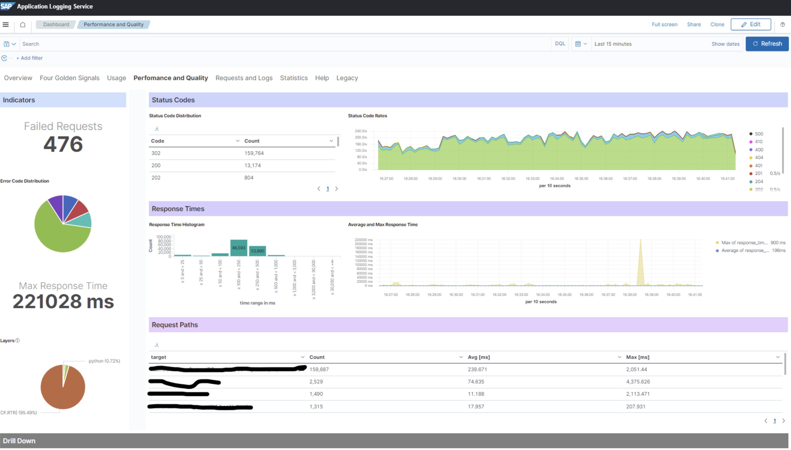
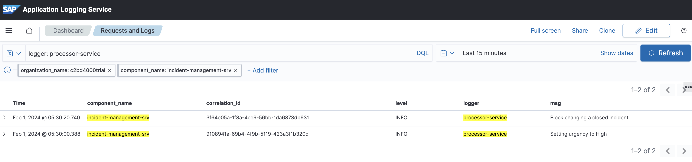
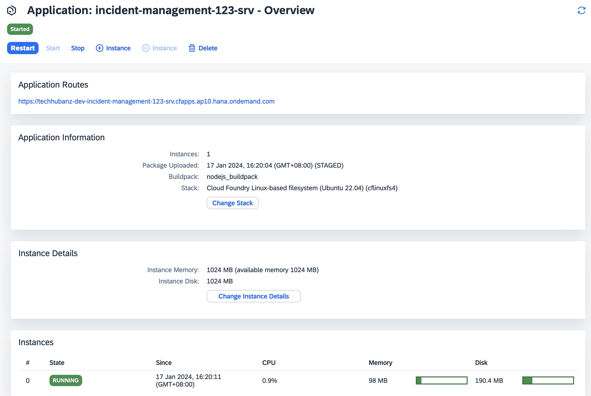

# Exercise 10 - Logging, Tuning and Hybrid Development

In this exercise we will learn
- Logging on BTP
- Resource tuning
- Hybrid Development


## Logging

Logging is a very important component of any app. Cloud Foundry provides rudimentary default logging support via the `cf logs <appname>` command. In addition, SAP BTP provides the [Application Logging Service](https://discovery-center.cloud.sap/serviceCatalog/application-logging-service?region=all) which can be bound to your app for streaming logs (kept for 7 days) and capturing app health metrics. The service uses the OpenSearch and Kibana to store and visualise the logs.

> There is also the new [Cloud Logging Service](https://discovery-center.cloud.sap/serviceCatalog/cloud-logging?service_plan=overall-(large,-standard,-dev)&region=all&commercialModel=cloud) which provides more extensive logging capabilities, storage durations and full Kibana access. Use this in cases where you have very high volumes of logs across your applications and/or where you need to retain logs for longer than 7 days. As of Q1, 2024 it does not yet provide the health monitoring capabilities like the _4-golden-signals_.



Lets add a binding to the logging service in our deployment config file `mta.yaml` under the `resources` section (only the `lite` service plan is available under a free-trial account):

```
...
resources:
...
- name: incident-management-<xxx>-logs
  type: org.cloudfoundry.managed-service
  parameters:
    service: application-logs
    service-plan: standard        # use lite for free-trial acccounts
```

Also in the `mta.yaml` we need to update the CAP `srv` module and the db deployer module to bind to the application logging resource:

```
...
modules:
  ...
  - name: incident-management-<xxx>-srv
    ...
    requires:
      ...
      - name: incident-management-<xxx>-logs

```

```
modules:
  ...
  - name: incident-management-<xxx>-db-deployer
    ...
    requires:
      ...
      - name: incident-management-<xxx>-logs
```

Before we redeploy the app using the Application Logging Service, let's take a look at CAP's logging facade...

### CAP logging facade

[CAP provides support for logging](https://cap.cloud.sap/docs/node.js/cds-log#minimalistic-logging-facade) above the standard JavaScript `console.log()` statement.

Here's how you can create a CAP logger called **sql** and write logs:

```js
const LOG = cds.log('sql');
LOG.info ('whatever', 'you', 'like...');
```

> Its very handy to be able to have your own loggers as the name used is prefixed in the log output (e.g. Kibana). Check the documentation for more information on log levels and options.

Edit the `srv/processor-service.js` file and add the following under `const cds = require('@sap/cds')`:

```js
const LOG = cds.log('processor-service');
```

Now, replace all `console.log()` statement with `LOG.info()` statements.

**Redeploy the project and inspect the logs:**

```bash
npm run build
```

```bash
npm run deploy
```

**Run the app in SAP BTP (to generate some logs).**

Access the kibana dashboard:

- In SAP BTP Cockpit, navigate to your Subaccount.
- Choose Cloud Foundry → Spaces.
- Choose your space.
- Choose the application whose logs you want to access.
- Choose Logs.
- Choose Open Kibana Dashboard.

Filter the dashboard to the subaccount and app you are interested in.

Search on `logger: processor-service` to see the logs we have issues from our custom logger. Or search on `error` to see any error log output.

> Note that your custom log output will now look similar to this example:
```
[processor-service] Block changing a closed incident
```



## Memory Usage, Scaling and Tuning

If we look at the definition of the CAP Service and DB deployer modules in the mta.yaml there are no parameters to specify how much memory or disk to allocate. By default they will be set to 1GB or CF memory and 1GB of disk (each module). From a scaling perspective - one instance of your app will be started.

Now that we have deployed our app we can have a look at how much resources they really consume.

Navigate to the dev space in the subaccount (BTP cockpit). Inspect the CAP service application:



We can see its using around 100MB of memory even though we allocated (by default: 1GB).

We can adjust the memory allocated directly in the cockpit or in the mta.yaml. **Let's adjust the mta.taml config and set a lower memory usage of 256MB.**

> Note: Currently the app is using around 100MB, but what if we add lots of users? The memory usage will increase.
    - We can tune the parameter to what we believe is a safe value
    - We can track the usage via the kibana dashboard and its health metrics (see application logging service above)
    - We can use the [BTP Alert Notification Service](https://discovery-center.cloud.sap/serviceCatalog/alert-notification?region=all) to alert us (the operations teams) to high memory usage
    - We can use the [BTP Application Auto-Scaler Service](https://discovery-center.cloud.sap/serviceCatalog/application-autoscaler?service_plan=standard&region=all&commercialModel=cloud) to automatically handle high-memory situation and increase the allocated values.
    - To handle higher loads we can also start multiple instances of the CAP application (this can also be automated with the auto-scaler).

In the `mta.yaml` file, edit the `incident-management-<xxx>-srv` module and add the `memory` and `disk-quota` settings under `parameters`. Set the allocated memory to `256M` and disk quota to `512M`:

```
- name: incident-management-<xxx>-srv
  type: nodejs
  path: gen/srv
  requires:
  - name: incident-management-<xxx>-db
  - name: uaa_incident-management-<xxx>
  provides:
  - name: srv-api
    properties:
      srv-url: ${default-url}
  parameters:
    buildpack: nodejs_buildpack
    memory: 256M
    disk-quota: 512M
  build-parameters:
    builder: npm
```

Redeploy the project and inspect the memory usage:
```bash
npm run build
```

```bash
npm run deploy
```

> Note: It's the **allocated memory** that is metered for billing in your BTP cloud foundry envrionment and not the actual amount used. So by leaving default settings you may be paying too much!

## Test your incidents-management app with SAP HANA Cloud and the hybrid profile

You can easily test your CAP application using a local database and mock ups and this is fantastic for rapid iteration. But at some point, you’re going to want to test with real cloud services.

Of course, you can always deploy your application to the cloud, but with hybrid testing capabilities, you can stay in your local development environment and avoid the long turnaround times of cloud deployment. And you can selectively decide which services you want to use from the cloud. _This also allows you to debug your code while using real SAP BTP services_.

> Often your project will have database specific entities or code. For example the sql function to format a date is different between HANA and SQLite. Binding to the real HANA Cloud with a hybrid profile is a great way to test that...

Use the `cds bind` command to connect your application to services on the cloud. Start your application with the hybrid profile to use these service bindings. You can switch between local mock configuration and cloud service configuration by simply setting or omitting the profile parameter.

1. Ensure you are logged into your cloud foundry space.

    ```bash
    cf l
    ```

2. Add a hybrid profile for SAP HANA Cloud development:

    ```bash
    cds add hana --for hybrid
    ```

This adds a new "hybrid" profile to the CAP configuration inside `package.json`.

### Connect to your HANA Cloud db

You already have a running instance of HANA Cloud which has been used in this tutorial. Here we will bind it to our dev space.

1. Open up your subaccount and CF space containing the HANA Cloud instance.
   
2. Open Services - Instances and search for your db service (incident-management-xxx-db).

    > Create a new service key (if one does not already exist). Give it a simple name such as `key`.
    The service key contains the credentials necessary to connect to the database.

3.  Back in the BAS terminal enter the following command to bind your local environment to the HANA Cloud db (using the created service key name).

    ```bash
    cds bind -2 incident-management-<xxx>-db:key
    ```

    Binding to your SAP BTP Cloud Foundry services in this fashion does not store the credentials locally. This makes it a superior technique over the previous `default-env.json` method where you store the usernames and passwords for the service.

4. Optional: You can check the binding details with:

    ```bash
    cds env get requires.db.credentials --profile hybrid --resolve-bindings
    ```

5. Run your app with the `hybrid` profile.

    ```bash
    cds watch --profile hybrid
    ```
    
    > You can deploy further changes to your data model directly to hana with `cds deploy --to hana --profile hybrid`.

## Summary

In this exercise we have covered some miscellaneous topics that can be very important when deploying production applications.
- Logging
- Resource scaling
- Hybrid development.

Continue to - [Exercise 11 - OPTIONAL - Implement Remote Service Connectivity](../Implement%20Remote%20Service%20Connectivity/README.md)
