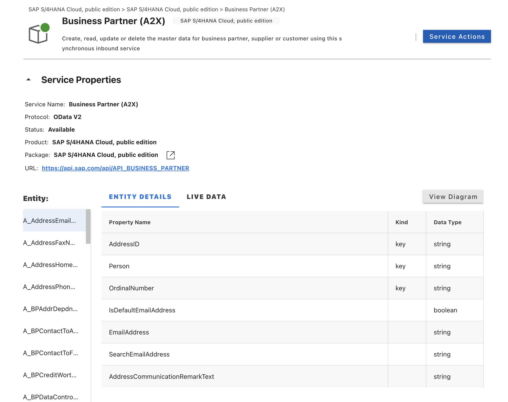
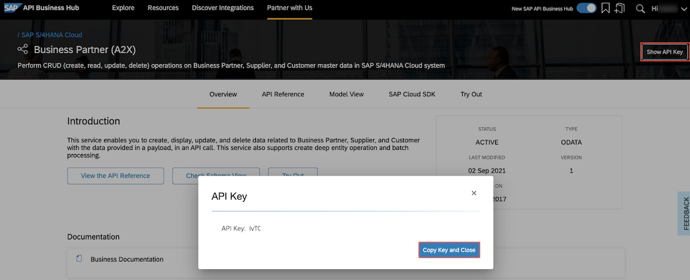

# Exercise 11 - OPTIONAL - Implement Remote Service Connectivity

In this exercise you will learn
- How to import API specification of an SAP S/4HANA Service Business Partner API
- Extend Incident Management Application to enable Remote Service Integrations

## Pre-requisites

1. Add additional libraries to the package.json for the communication with external systems. In the terminal go to the root folder of your project and run the following command:  
   
   ```bash
   npm add @sap-cloud-sdk/http-client
   ```

   > Don't worry if your building a new project and you forget dependencies like this... you will be alerted by an error when the remote call is made by CAP (**check the logs**).

## Import API Specification

SAP publishes service definitions for its major products on [SAP Business Accelerator Hub](http://api.sap.com). These service definitions are required to use remote services in CAP. For example, to call a remote service, build projections upon them, and to mesh-up with them.

Since we are using the Business Application Studio (BAS) for these exercises we can make use of the Service Centre panel.


### Import the business partner api specification from the BAS Service Center

Open the Service Center panel and drill down to the **SAP S4/HANA Cloud Public Edition** business system.

Double-click the `Business Partner (A2X) (V2)` API and log-in with your SAP Business Accelerator Hub credentials.



Click on the **Add to CAP** button.

A wizard is started - simple choose your root project folder and leave the `Do you want to create a sample service` set to **No**. We will add the service ourselves below.

Inspect the `cds.requires` section of the `package.json` file for the remote call config.

### Alternatively, download the API spec manually from api.sap.com

Download the Business Partner API by going to this URL: [Business Partner API (A2X)](http://api.sap.com/api/API_BUSINESS_PARTNER/overview).

Go to section **API Specification** and download the EDMX file.

> You need to log in first. Use your personal user. Accept the terms and conditions.

Drag-and-drop the downloaded edmx file into your BAS project.

> To ensure the rest of the exercise works regardless of which method of importing the API you chose, rename the downloaded specification file to: `BusinessPartnerA2X.edmx`.

Now import the specification to your CAP project:

```bash
cds import BusinessPartnerA2X.edmx --as cds
```

Inspect the `cds.requires` section of the `package.json` file for the remote call config.

## Create a projection on the remote service.

1. We will only use two fields from the BusinessPartner. To do this create a __projection__ on the external service.

    Create a file `srv/external/index.cds` with this content:

    ```js
    using {BusinessPartnerA2X as S4} from './BusinessPartnerA2X.cds';

    namespace s4.simple;

    @readonly
    entity BusinessPartner as projection on S4.A_BusinessPartner {
        key BusinessPartner as ID,
            BusinessPartnerFullName
    };
    ```

    > We store this s4.simple.Customers definition in the external folder to promote the idea that such a model could come from a third party, a partner or so. In a later exercise about prebuilt packages you will learn more about it.

## Test with mocked remote services

1. First, add some test data.

    Kill cds watch or preview (if running), and in the terminal, create a new file: `srv/external/data/BusinessPartnerA2X-A_BusinessPartner.csv`

    Add the following test data to the new file:

    ```csv
    BusinessPartner;BusinessPartnerFullName
    Z100001;Harry Potter
    Z100002;Sherlock Holmes
    Z100003;Sunny Sunshine
    ```

2. Run `cds watch` again and check its ouput. You find the information about what's going on:

    ```
    ...
    > init from srv/external/data/BusinessPartnerA2X-A_BusinessPartner.csv
    ...
    [cds] - mocking BusinessPartnerA2X { path: '/odata/v4/business-partner-a2-x' }
    [cds] - serving ProcessorService { path: '/odata/v4/processor', impl: 'srv/processor-service.js' }
    ```

You see that the external service `BusinessPartnerA2X` is mocked, i.e. served in the application although in production it would come from remote. This is because we haven't specified yet how to connect it to a real remote data source.

The CSV file with the mock data got deployed.
`cds watch` runs in a 'mock mode' by default. In production, this won't happen, as the application is started with `cds run`. See the documentation for how cds watch binds to services.

## Delegating Requests.

1. Expose the remote BusinessPartner in the ProcessorService.

    Create a new file `srv/mashup.cds` and add this snippet, so that BusinessPartner appears in the API of the ProcessorService.

    Also in the same file, add an association from Incidents to BusinessPartner, to allow queries on which incident refers to which businessPartner (like /Incidents('...')/businessPartner).

    ```js
    using { ProcessorService } from './processor-service';
    using { s4 } from './external';

    extend service ProcessorService with {
      entity BusinessPartner as projection on s4.simple.BusinessPartner;
    }

    extend sap.capire.incidents.Incidents with {
      businessPartner : Association to s4.simple.BusinessPartner;
    }
    ```

2. Delegate calls to remote system

    For access to the BusinessPartner data to work, we need to redirect the request to the remote system (or our mock). Otherwise, the framework would read it from a local DB table, which does not exist.

    Update the file `srv/processor-service.js` with the following code (**completely replace it**):

    ```js
    const cds = require('@sap/cds');
    const LOG = cds.log('processor-service');

    class ProcessorService extends cds.ApplicationService {
      /** Registering custom event handlers */
      async init() {
        this.S4bupa = await cds.connect.to('BusinessPartnerA2X');

        // Delegate remote api calls for Business Partners and Incidents expanding Business Partners
        this.on('READ', 'BusinessPartner', (req) => this.readBusinessPartner(req));
        this.on("READ", 'Incidents', async (req, next) => this.readIncidents(req, next));

        this.before("UPDATE", "Incidents", (req) => this.onUpdate(req));
        this.before("CREATE", "Incidents", (req) => this.changeUrgencyDueToSubject(req.data));

        return super.init();
      }

      readBusinessPartner(req) {
        console.log('>> delegating to S4 service...');
        return this.S4bupa.run(req.query);
      }

      async readIncidents(req, next) {
        if (!req.query.SELECT.columns) return next();
        const expandIndex = req.query.SELECT.columns.findIndex(
          ({ expand, ref }) => expand && ref[0] === "businessPartner"
        );
        if (expandIndex < 0) return next();

        // Remove expand from query
        req.query.SELECT.columns.splice(expandIndex, 1);

        // Make sure businessPartner_ID will be returned
        if (!req.query.SELECT.columns.indexOf('*') >= 0 &&
          !req.query.SELECT.columns.find(
            column => column.ref && column.ref.find((ref) => ref == "businessPartner_ID"))
        ) {
          req.query.SELECT.columns.push({ ref: ["businessPartner_ID"] });
        }

        const incidents = await next();

        const asArray = x => Array.isArray(x) ? x : [x];

        // Request all associated partners
        const partnerIds = asArray(incidents).map(incident => incident.businessPartner_ID);
        const partners = await this.S4bupa.run(SELECT.from('ProcessorService.BusinessPartner').where({ ID: partnerIds }));

        // Convert in a map for easier lookup
        const partnersMap = {};
        for (const partner of partners)
          partnersMap[partner.ID] = partner;

        // Add partners to result
        for (const note of asArray(incidents)) {
          note.businessPartner = partnersMap[note.businessPartner_ID];
        }

        return incidents;
      }

      changeUrgencyDueToSubject(data) {
        if (data) {
          const incidents = Array.isArray(data) ? data : [data];
          incidents.forEach((incident) => {
            if (incident.title?.toLowerCase().includes("urgent")) {
              LOG.info("Set urgency to High");
              incident.urgency = { code: "H", descr: "High" };
            }
          });
        }
      }

      /** Custom Validation */
      async onUpdate(req) {
        const { status_code } = await SELECT.one(req.subject, i => i.status_code).where({ ID: req.data.ID })
        if (status_code === 'C') {
          LOG.info("Can't edit a closed incident");
          return req.reject(`Can't modify a closed incident`)
        }
      }
    }
    module.exports = ProcessorService
    ```

    In the above we have have added an `.on()` handler for the BusinessPartner. We can simply delegate this to the remote api with this: `return this.S4bupa.run(req.query)`.

    > Simple delegation like this to a remote service will not handle expands on associations to or from the remote API. To enable expands from Incidents to BusinessPartners we added an `/on()` handler when reading Incidents as well. You can test the expand with a url ending with `.../odata/v4/processor/Incidents?$expand=businessPartner`. Add some business partner mock data first (next step).

3. Add some business partner values to the Incidents test data.

    Replace the file `db/data/sap.capire.incidents-Incidents.csv` with the following:

    ```csv
    ID,customer_ID,title,urgency_code,status_code,businessPartner_ID
    3b23bb4b-4ac7-4a24-ac02-aa10cabd842c,8fc8231b-f6d7-43d1-a7e1-725c8e988d18,Inverter not functional,H,C,Z100001
    3a4ede72-244a-4f5f-8efa-b17e032d01ee,feb04eac-f84f-4232-bd4f-80a178f24a17,No current on a sunny day,H,N,Z100002
    3ccf474c-3881-44b7-99fb-59a2a4668418,feb04eac-f84f-4232-bd4f-80a178f24a17,Strange noise when switching off Inverter,M,N,Z100003
    3583f982-d7df-4aad-ab26-301d4a157cd7,2b87f6ca-28a2-41d6-8c69-ccf16aa6389d,Solar panel broken,H,I,Z100001
    ```

4. Test locally with `cds watch` and inspect the ProcessorService.

## Test with remote system (sandbox)

1. Use the SAP Business Accelerator Hub **sandbox**.

    As a ready-to-use remote service, we use the sandbox system of SAP API Business Hub.

    > To use your own SAP S/4HANA Cloud system, see this [tutorial](https://developers.sap.com/tutorials/btp-app-ext-service-s4hc-use.html). You don't need it for this tutorial though.

    Create a new file .env in the incident-management project root folder and add environment variables that hold the URL of the sandbox as well as a personal API Key:

    ```
    DEBUG=remote
    cds.requires.BusinessPartnerA2X.[sandbox].credentials.url=https://sandbox.api.sap.com/s4hanacloud/sap/opu/odata/sap/API_BUSINESS_PARTNER
    cds.requires.BusinessPartnerA2X.[sandbox].credentials.headers.APIKey=<your api key>
    ```

    Note the [sandbox] segment which denotes a [configuration profile](https://cap.cloud.sap/docs/node.js/cds-env#profiles) named sandbox. The name has no special meaning. You will see below how to use it.

2. Get an API key.

    - Go back to the [Business Partner (A2X)](https://api.sap.com/api/API_BUSINESS_PARTNER/) API page.
    - Choose Show API Key on the right. 
    - Choose Copy Key and Close.

    

3. Add the key to the `.env` file.

    > By putting the key in a separate file, you can exclude it from the Git repository (see the .gitignore file). **Add it to you `.gitignore` now**.

    > Also note how the `cds.requires.BusinessPartnerA2X` structure in the .env file matches to the package.json configuration.
    > To learn about more configuration options for CAP Node.js applications, see the [documentation](https://cap.cloud.sap/docs/node.js/cds-env).

4. Add the `.env` file to the .gitignore
    > We don't want to publish API keys to our git server (GitHub.com)

5. Test with the sandbox system

    Now kill the server with `Ctrl+C` and run again with the profile activated:

    ```bash
    cds watch --profile sandbox
    ```

    In the server log, you can see that the configuration is effective:

    ```bash
    ...
    [cds] - connect to BusinessPartnerA2X > odata-v2 {
      url: 'https://sandbox.api.sap.com/s4hanacloud/sap/opu/odata/sap/BusinessPartnerA2X',
      headers: { APIKey: '...' }
    }
    ...
    ```

    On the application's index page, the mocked service is gone, because it is no longer served in the application. Instead, it is assumed to be running in a remote system. Through the configuration above, the system knows how to connect to it.

    Open `odata/v4/processor/BusinessPartner` to see the data coming from the remote system.

    > If you get a 401 error instead, check your API key in the .env file. After a change in the configuration, kill the server with Ctrl+C and start it again.

    You can also see something like this in the log (due to the DEBUG=remote variable from the .env file above):


    ```
    [remote] - GET https://.../BusinessPartnerA2X/A_BusinessPartner
      ?$select=BusinessPartner,BusinessPartnerFullName&$inlinecount=allpages&$top=74&$orderby=BusinessPartner%20asc
    ...
    ```

    > This is the remote request sent by the framework when `S4bupa.run(req.query)` is executed. The `req.query` object is transparently translated to an OData query `$select=BusinessPartner,BusinessPartnerFullName&$top=...&$orderby=...`. The entire HTTP request (completed by the sandbox URL configuration) is then sent to the remote system with the help of SAP Cloud SDK.

    > Note how simple the execution of remote queries is. No manual OData query construction needed, no HTTP client configuration like authentication, no response parsing, error handling, issues like hard-wired host names etc.

    > See the [documentation on CQN](https://pages.github.tools.sap/cap/docs/cds/cqn) for more on such queries in general. The [service consumption guide](https://pages.github.tools.sap/cap/docs/guides/using-services#execute-queries) details out how they are translated to remote requests.


## Add the remote data properties to the UI

1. Put basic annotations that refer to the BusinessPartner itself in `srv/external/index.cds`, next to the BusinessPartner definition. Append this snippet:

    ```js
    annotate BusinessPartner with @UI.Identification: [{Value: BusinessPartnerFullName}];
    annotate BusinessPartner with @cds.odata.valuelist;

    annotate BusinessPartner with {
        ID                      @title: 'Business Partner ID';
        BusinessPartnerFullName @title: 'Business Partner Name';
    }
    ```

2. Annotations that refer to Incidents or its association to BusinessPartner should go to file `srv/mashup.cds`. Append this snippet there:

    ```js
    // import annotations from rest of the application
    using from '../app/services';

    annotate ProcessorService.Incidents with @(
      UI: {
        // insert table column (note: we changed the first table column from title to ID in an earlier ex.)
        LineItem : [
          ...up to { Value: ID },
          { Value:  businessPartner_ID, Label: 'Business Partner' },
          ...
        ],

        // insert businesspartner to field group
        FieldGroup #GeneratedGroup1 : {
          Data: [
            ...up to { Value: customer_ID },
            { Value: businessPartner_ID, Label: 'Business Partner'},
            ...
          ]
        },
      }
    );

    // for an incident's customer, show both name and ID
    annotate ProcessorService.Incidents:businessPartner with @Common: {
      Text: businessPartner.BusinessPartnerFullName,
      TextArrangement: #TextFirst
    };
    ```

    > Don't change the ellipsis `...` in the cds code above. It's a special syntax for refering to the 'remaining values' of array-valued annotations. The advantage of this syntax is that you do not have to repeat the other table columns. See the [documentation](https://cap.cloud.sap/docs/cds/cdl#extend-array-annotations) for more.

## Verify in the UI.

Now Open the incidents with the app preview (or `cds w`).

Create a new incident and select a Business Partner using the value help. When pressing Save, watch the console output of the application and see the >> delegating to S4 service... message.

 ## Summary
 You have integrated the Business Partner API into your project and business logic to to read the data from the backend system.

Continue to - [Exercise 12 - Enable Replication for the Remote Entity](../Enable%20Replication/README.md)
